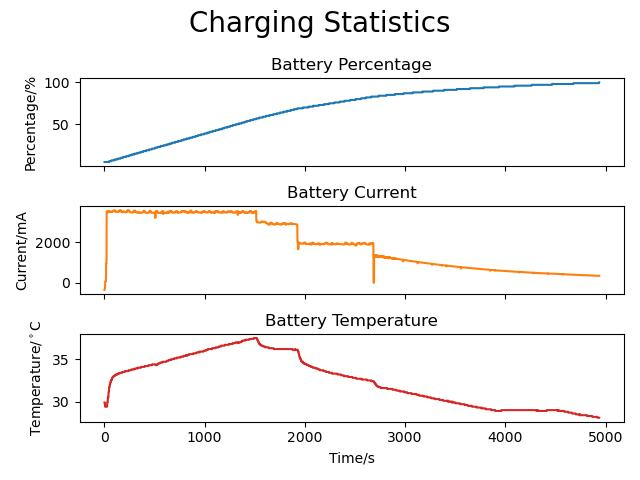

# Termux-Battery-Monitor
[](https://github.com/psf/black)

A python script to record charging statistics of an android phone using Termux, and write them to an image using matplotlib.

## Preparing Termux
### Install Termux and the Termux-API
Note that the Google Play versions of Termux are now obsolete. Use F-Droid to install Termux and Termux:API.
- Termux - https://f-droid.org/en/packages/com.termux/
- Termux:API - https://f-droid.org/en/packages/com.termux.api/

### Make Sure Termux and its Packages are up to date
- Open Termux
- Type in `pkg upgrade` (You may have to type `y` and hit enter for this)

### Setup Termux for the First Time
- Install Termux:API with `pkg install termux-api`
- Set up file access with `termux-setup-storage`

### Clone the repo and navigate to it
- `git clone https://github.com/NathanielJS1541/Termux-Battery-Monitor.git`
- `cd Termux-Battery-Monitor`

### Install required packages
- Install python (and pip) with `pkg install python`
- With python installed, you may need to manually install `numpy` and `matplotlib`: `MATHLIB="m" pip3 install numpy matplotlib`
- Install the rest of the required packages with `pip install -r requirements.txt`

## Running the script
Without providing any options, the script will monitor the battery percentage until it reaches 100%. It will then write the output data to a .jpeg file using matplotlib. A list of configuration options can be seen as follows:
```bash
 ~#@❯  python .\Graph_Battery_Data.py -h
usage: Graph_Battery_Data.py [-h] [-p [0-100]] [-t [0-259200]] [-o OUTPUT_FILE] [-v]

options:
  -h, --help            show this help message and exit
  -p [0-100], --percentage [0-100]
                        The percentage at which the script should stop recording. (default: 100)
  -t [0-259200], --time [0-259200]
                        The time (in seconds) after which the script should stop recording. (default: None)
  -o OUTPUT_FILE, --output-file OUTPUT_FILE
                        Path to the output .jpg file. (default: ./Battery_Statistics_2023-03-20_11-32-03.jpg)
  -v, --verbose         Print verbose messages. (default: False)
```

## Example Outputs
### OnePlus7 warp charging from 1% to 100%


### OnePlus5 dash charging from 5% to 100%
